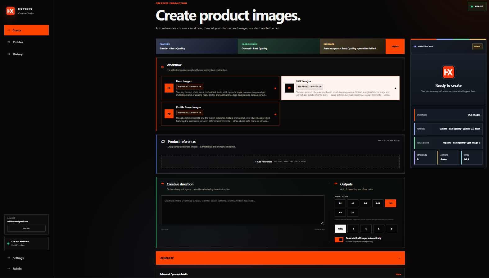
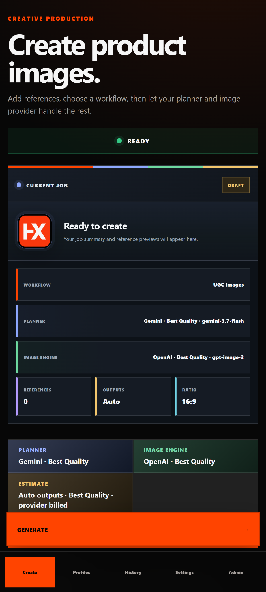
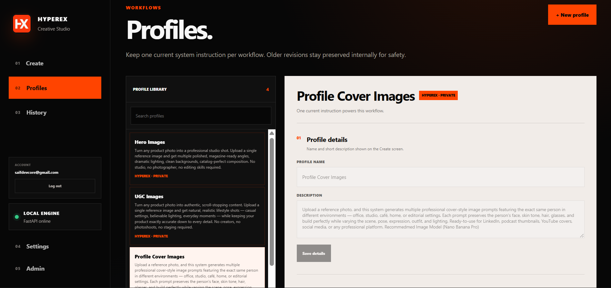
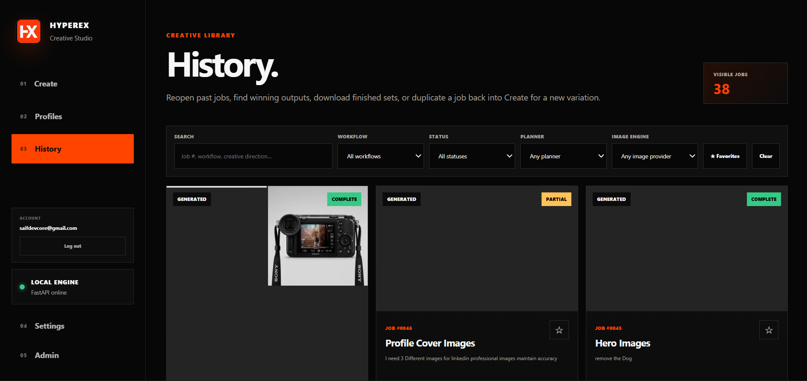
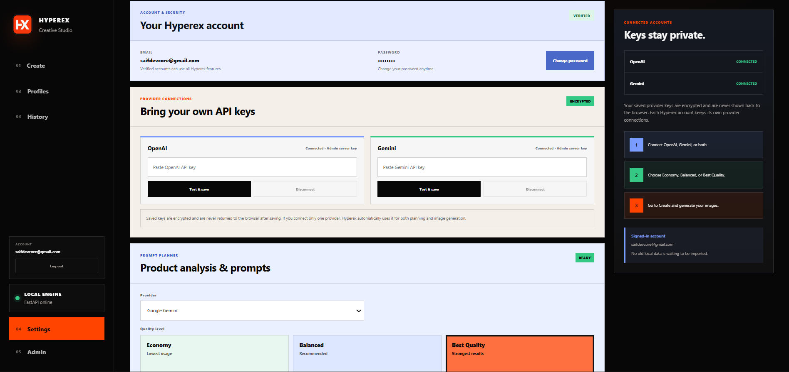
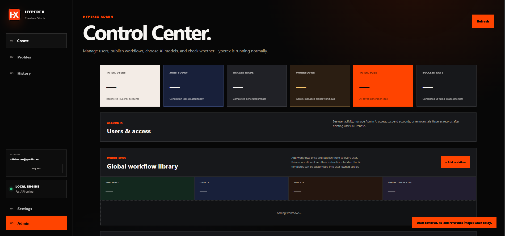
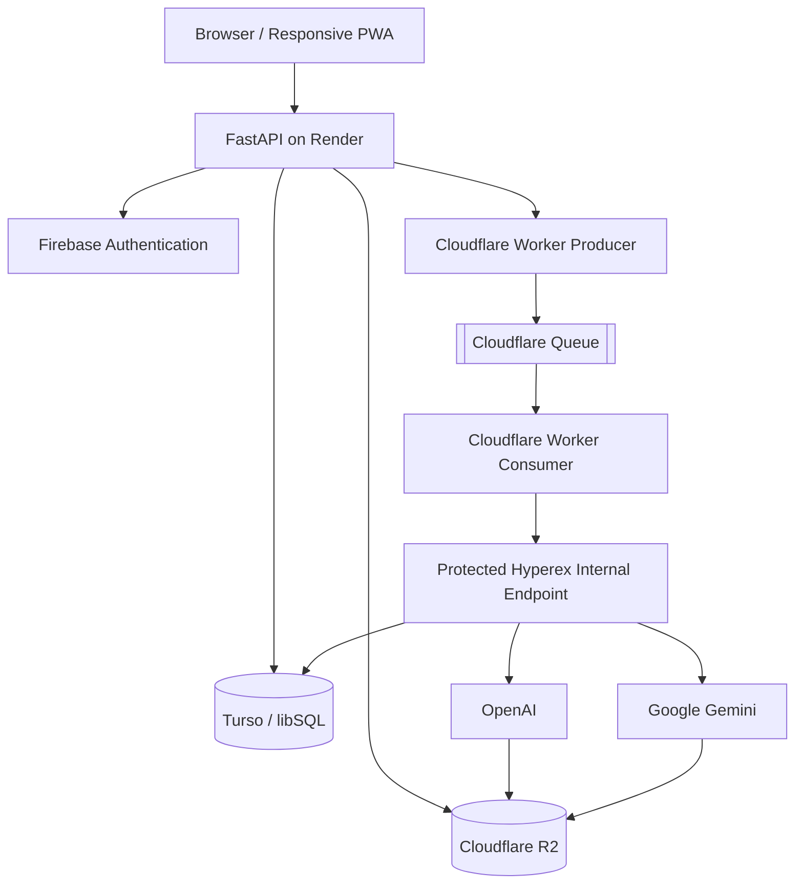

<p align="center">
  
</p>

<h1 align="center">Hyperex</h1>

<p align="center">
  <strong>AI Creative Studio built for Hypervail.</strong><br>
  Reusable creative workflows, stronger prompts, multi-provider image generation, and production history — in one place.
</p>

<p align="center">
  <a href="https://hyperex.onrender.com"><strong>Live Application</strong></a>
  ·
  <a href="#screenshots">Screenshots</a>
  ·
  <a href="#architecture">Architecture</a>
  ·
  <a href="#local-development">Local Development</a>
</p>

<p align="center">
  
  
  
  
  
  
</p>

---

## About Hyperex

**Hyperex** is an internal AI creative production application built for **Hypervail** to make repetitive image-generation work faster, more consistent, and easier to manage.

The original problem was simple: creating a strong image often meant moving between several tools — one place for prompt writing, another for image generation, separate notes for the exact instructions that worked, and another place to keep previous outputs.

Hyperex brings that workflow together.

A user can create or select a reusable **workflow/profile**, define the niche, environment, visual rules, and system instructions once, upload reference images, add an optional creative direction, and generate from the same controlled setup whenever needed.

The goal is not to retrain an AI model for every task. Instead, Hyperex keeps the important context reusable so the planner and image model receive the right instructions every time.

> **Define the workflow once. Reuse the creative intelligence many times.**

In practice, Hyperex behaves like a lightweight creative agent for Hypervail: it keeps reusable workflow rules, prepares structured prompts, sends work to the selected AI provider, processes generations in the background, stores results, and keeps job history available for later use.

---

## Why We Built It

Before Hyperex, a typical creative task could involve:

1. opening a prompt-writing tool,
2. explaining the same niche and environment again,
3. copying prompts into an image generator,
4. uploading references again,
5. tracking which prompts worked,
6. and rebuilding the setup for the next job.

Hyperex replaces that fragmented flow with one studio.

```text
Choose a workflow
      ↓
Upload reference images
      ↓
Add optional creative direction
      ↓
Choose quality + output settings
      ↓
Hyperex plans and verifies the prompts
      ↓
Cloudflare Queue processes the generation
      ↓
OpenAI / Gemini creates the images
      ↓
Results are saved to R2 + Turso
      ↓
Reopen, compare, favorite or download from History
```

---

## Core Features

### Reusable workflows and profiles

Users can create profiles for a specific niche, client, environment, product type, or creative style.

A profile stores reusable instructions so the user does not have to rebuild the same prompting strategy for every job.

Hyperex also supports **Hyperex-managed workflows**. Private managed workflows keep their system instructions on the server and do not expose private prompt text to normal users.

Current examples include:

- **Hero Images**
- **UGC Images**
- **Profile Cover Images**

### AI prompt planning

Hyperex separates **prompt planning** from **image generation**.

The planner studies the workflow rules, references, creative direction, requested output count, and selected quality tier before preparing structured prompt packages for the image engine.

That makes the process more repeatable than writing a new prompt manually every time.

### OpenAI and Gemini

Hyperex supports both **OpenAI** and **Google Gemini**.

Users work with simple quality tiers:

- **Economy**
- **Balanced**
- **Best Quality**

The actual model IDs behind those tiers are controlled from the Admin dashboard, so Hypervail can upgrade models later without changing the user experience.

### Bring Your Own Key (BYOK)

Users can securely connect their own OpenAI or Gemini API key.

Saved provider keys are encrypted server-side and are never returned to the browser after saving.

Provider access follows this priority:

```text
1. User's own saved provider key
2. Admin-approved Hyperex server key access
3. No provider access
```

If a user has only one provider connected, Hyperex can automatically use that provider for both planning and image generation.

### Multi-user accounts

Hyperex uses Firebase Authentication and supports:

- email/password sign-in,
- email verification,
- password reset,
- Google sign-in,
- secure HTTP-only application sessions.

Jobs, custom profiles, provider credentials, settings, history, and generated assets are isolated by user ownership.

### Reference image handling

Users can upload multiple reference images and reorder them before generation.

Hyperex normalizes uploaded raster images into provider-safe formats when required. This helps with formats and color modes such as HEIC, TIFF, CMYK, palette-based images, and other common upload variations.

### Aspect ratios and output batches

The Create studio supports common ratios including:

```text
1:1
4:5
3:4
9:16
16:9
4:3
3:2
```

Users can select automatic output count or choose a specific batch size within configured safety limits.

### Background generation with Cloudflare Queues

Production generation is asynchronous.

The browser does **not** need to stay open while a queued generation is running.

Hyperex sends a small authenticated task to a Cloudflare Worker, which publishes it to Cloudflare Queues. The queue consumer securely calls the internal Hyperex worker endpoint, and FastAPI completes the generation independently of the browser session.

Queue messages contain task metadata — not API keys, image bytes, or private workflow prompts.

Hyperex also tracks queue tasks so duplicate queue delivery does not accidentally create duplicate generations.

### Private Cloudflare R2 storage

Reference images and generated outputs are stored in a private **Cloudflare R2** bucket.

Objects are separated by user and job:

```text
users/<user-id>/jobs/<job-id>/references/...
users/<user-id>/jobs/<job-id>/outputs/...
```

Private files are accessed through short-lived signed URLs instead of making the bucket public.

### Creative History

History keeps completed and partial jobs searchable and reusable.

Users can:

- search jobs,
- filter by workflow, status, planner, or image engine,
- favorite jobs and outputs,
- reopen previous generations,
- download finished images,
- duplicate useful work back into Create,
- review complete and partial batches.

### Responsive web application

The frontend uses vanilla HTML, CSS, and JavaScript and is designed for desktop and mobile.

A web manifest and service worker provide a lightweight PWA-style experience.

### Admin Control Center

Administrators can manage:

- users and account status,
- Admin AI/server-key permissions,
- model registry and tier mapping,
- global managed workflows,
- private vs public workflow behavior,
- workflow publishing and versioning,
- platform statistics,
- recent failures and system status.

---

<a id="screenshots"></a>

## Screenshots

### Create Studio — Desktop

<p align="center">
  
</p>

### Create Studio — Mobile

<p align="center">
  
</p>

### Profiles & Workflows

<p align="center">
  
</p>

### Creative History

<p align="center">
  
</p>

### Settings & Provider Connections

<p align="center">
  
</p>

### Admin Control Center

<p align="center">
  
</p>

---

<a id="architecture"></a>

## Architecture

Hyperex is split into adapters so local development and cloud production can use different services without rewriting the application.



### Production stack

```text
Authentication  → Firebase
Backend         → Python 3.13 + FastAPI
Application     → Render
Database        → Turso / libSQL
Storage         → Cloudflare R2
Queue           → Cloudflare Queues + Workers
AI              → OpenAI + Google Gemini
Frontend        → HTML + CSS + Vanilla JavaScript
```

---

## Technology Stack

| Area | Technology | Purpose |
|---|---|---|
| Frontend | HTML, CSS, Vanilla JavaScript | Responsive studio UI |
| PWA | Web Manifest + Service Worker | App shell, mobile experience and asset caching |
| Backend | Python 3.13 + FastAPI | APIs, business logic, user isolation and workflow orchestration |
| Server | Uvicorn | ASGI server |
| Authentication | Firebase Authentication | Email/password, verification, password reset and Google sign-in |
| Database | Turso / libSQL | Users, profiles, jobs, history, settings and operational state |
| Local DB adapter | SQLite | Local development/fallback |
| Object storage | Cloudflare R2 | Private references and generated outputs |
| Background queue | Cloudflare Queues + Workers | Durable image-generation jobs |
| Hosting | Render | FastAPI application and static frontend |
| AI providers | OpenAI + Google Gemini | Planning and image generation |
| Encryption | `cryptography` / Fernet | Encryption of saved provider credentials |
| HTTP | HTTPX | External service communication |
| R2 client | Boto3 | S3-compatible R2 access |
| Image processing | Pillow + pillow-heif | Validation and image normalization |
| Uploads | python-multipart | Multipart reference-image uploads |

---

## How the Workflow System Works

A Hyperex workflow can encode reusable creative context such as:

```text
Purpose
Target niche
Environment
Lighting direction
Composition rules
Product accuracy rules
Brand/style expectations
Prompting constraints
System instructions
```

When a user starts a job, Hyperex combines:

```text
Workflow instruction
+
Reference images
+
Optional creative direction
+
Requested output settings
+
Selected AI quality tier
```

and turns that into structured generation work.

The user does not need to explain the entire niche again for every image.

Custom workflows belong to their user. Hyperex-managed private workflows are controlled by Admin and can keep instructions server-only.

---

## Provider and Model Strategy

Hyperex uses friendly quality tiers instead of forcing users to manage model IDs directly.

| Tier | Intended use |
|---|---|
| Economy | Lower-cost routine work |
| Balanced | General recommended production |
| Best Quality | Strongest configured results |

The Admin model registry decides which real model is assigned to each tier.

---

## Security & Privacy

Hyperex was designed as a multi-user application rather than a shared single-user tool.

Important protections include:

- Firebase-authenticated sessions,
- secure HTTP-only cookies,
- email verification,
- owner-scoped jobs, profiles, history and files,
- encrypted BYOK credentials,
- Admin-controlled server AI access,
- private R2 bucket,
- signed R2 URLs,
- user/job-separated R2 paths,
- protected internal queue endpoint,
- shared queue secret between Worker and Hyperex,
- metadata-only queue messages,
- private workflow instructions kept out of frontend assets.

> **Never commit `.env`, provider keys, Firebase credentials, Turso tokens, R2 credentials, queue secrets, encryption keys, or private workflow prompt files to Git.**

---

## Project Structure

```text
hypervail-image-generator/
│
├── app/
│   ├── main.py
│   ├── auth_service.py
│   ├── job_store.py
│   ├── image_service.py
│   ├── planner_service.py
│   ├── normalizer_service.py
│   ├── history_service.py
│   ├── credential_store.py
│   ├── provider_access.py
│   ├── managed_workflow_service.py
│   ├── model_registry.py
│   ├── user_service.py
│   ├── queue_task_store.py
│   │
│   └── platform/
│       ├── database_backend.py
│       ├── storage_backend.py
│       └── queue_backend.py
│
├── cloudflare-worker/
│   ├── src/
│   │   └── index.js
│   └── wrangler.jsonc
│
├── static/
│   ├── index.html
│   ├── app.js
│   ├── styles.css
│   ├── service-worker.js
│   ├── manifest.webmanifest
│   └── icons/
│
├── docs/
│   └── screenshots/
│
├── requirements.txt
├── render.yaml
└── README.md
```

---

<a id="local-development"></a>

## Local Development

### Requirements

- Python 3.13
- Git
- Node.js/npm if working on the Cloudflare Worker

### Clone

```bash
git clone https://github.com/saifdevx/hypervail-image-generator.git
cd hypervail-image-generator
```

### Create a virtual environment

#### Windows PowerShell

```powershell
python -m venv .venv
.\.venv\Scripts\Activate.ps1
```

#### macOS / Linux

```bash
python3 -m venv .venv
source .venv/bin/activate
```

### Install dependencies

```bash
pip install -r requirements.txt
```

### Simple local configuration

Create a private `.env`:

```env
AUTH_PROVIDER=local
DATABASE_PROVIDER=sqlite
STORAGE_PROVIDER=local
QUEUE_PROVIDER=local
COOKIE_SECURE=false
```

Then run:

```bash
uvicorn app.main:app --reload
```

Open:

```text
http://127.0.0.1:8000
```

Health check:

```text
http://127.0.0.1:8000/health
```

---

## Production Environment Variables

Do not commit real values.

### Application

```env
AUTH_PROVIDER=firebase
DATABASE_PROVIDER=turso
STORAGE_PROVIDER=r2
QUEUE_PROVIDER=cloudflare
COOKIE_SECURE=true

HYPEREX_ADMIN_UID=...
APP_ENCRYPTION_KEY=...
```

`APP_ENCRYPTION_KEY` must remain stable because it protects encrypted user provider credentials.

### Firebase / Google

```env
FIREBASE_WEB_API_KEY=...
GOOGLE_OAUTH_CLIENT_ID=...
```

### Turso

```env
TURSO_DATABASE_URL=...
TURSO_AUTH_TOKEN=...
```

### Cloudflare R2

```env
R2_ACCOUNT_ID=...
R2_ACCESS_KEY_ID=...
R2_SECRET_ACCESS_KEY=...
R2_BUCKET=...
```

### Cloudflare Queue

```env
CLOUDFLARE_QUEUE_PRODUCER_URL=https://<worker>.<subdomain>.workers.dev/enqueue
HYPEREX_QUEUE_SHARED_SECRET=...
```

The same shared secret must be configured securely on the Cloudflare Worker.

### AI providers

Server provider keys are optional when users bring their own keys.

```env
OPENAI_API_KEY=...
GEMINI_API_KEY=...
```

A user's saved provider key takes priority over an allowed server key.

### Private workflow files

```env
HERO_WORKFLOW_PATH=/path/to/private/hero_images.txt
UGC_WORKFLOW_PATH=/path/to/private/ugc_images.txt
```

Private workflow instructions should never be placed under `static/` or committed to a public repository.

---

## Cloudflare Queue Worker

Production background generation uses `cloudflare-worker/`.

```text
Render
  ↓ authenticated /enqueue
Worker producer
  ↓
Cloudflare Queue
  ↓
Worker consumer
  ↓ authenticated internal call
Hyperex FastAPI
```

Useful Wrangler commands:

```bash
cd cloudflare-worker
npx wrangler@latest login
npx wrangler@latest deploy
```

Store the worker secret securely:

```bash
npx wrangler@latest secret put HYPEREX_QUEUE_SHARED_SECRET
```

Never place the secret directly in `wrangler.jsonc`.

---

## Deployment

Hyperex is deployed on **Render**.

```text
Build:
pip install -r requirements.txt

Start:
uvicorn app.main:app --host 0.0.0.0 --port $PORT

Health:
GET /health
```

Live application:

**https://hyperex.onrender.com**

---

## Important Operational Notes

### Keep the encryption key stable

Do not rotate `APP_ENCRYPTION_KEY` casually. Previously saved provider keys depend on it.

### Keep R2 private

Hyperex is designed around private object storage and signed URLs.

### Keep managed prompts private

Private workflow system instructions must remain server-side and should never be exposed through frontend files, public APIs, Git, or queue messages.

### Keep queue tasks small

Queue messages should contain only job/task identifiers and small metadata. API keys, image bytes and private prompts do not belong in queue payloads.

### Preserve user ownership checks

When adding new routes or features, every user-owned query should continue to enforce ownership. Knowing a job ID is not permission to access that job.

---

## Current Project Status

```text
✅ Responsive desktop/mobile studio
✅ Firebase email/password authentication
✅ Google sign-in
✅ Email verification and password recovery
✅ Multi-user data isolation
✅ Admin roles and account controls
✅ Encrypted BYOK provider credentials
✅ Admin-controlled server AI access
✅ OpenAI planner/image support
✅ Gemini planner/image support
✅ Economy / Balanced / Best Quality tiers
✅ Custom profiles
✅ Admin-managed global workflows
✅ Private Hyperex workflows
✅ Image normalization
✅ Multiple references and aspect ratios
✅ Batch generation and retries
✅ History, favorites and downloads
✅ Turso cloud database
✅ Cloudflare R2 private storage
✅ Render production deployment
✅ Cloudflare Queues background generation
✅ Generation continues after the browser closes
```

---

## Built for Hypervail

Hyperex is a Hypervail workflow tool built around one practical idea:

> Good AI production should not require rebuilding the same context every time.

By combining reusable creative instructions, prompt planning, image generation, background processing, private storage, and job history in one application, Hyperex gives Hypervail a consistent workspace for turning reference material into production-ready creative output.

---

<p align="center">
  <strong>HYPEREX · Creative Studio</strong><br>
  Built for faster, more reliable creative production at Hypervail.
</p>
